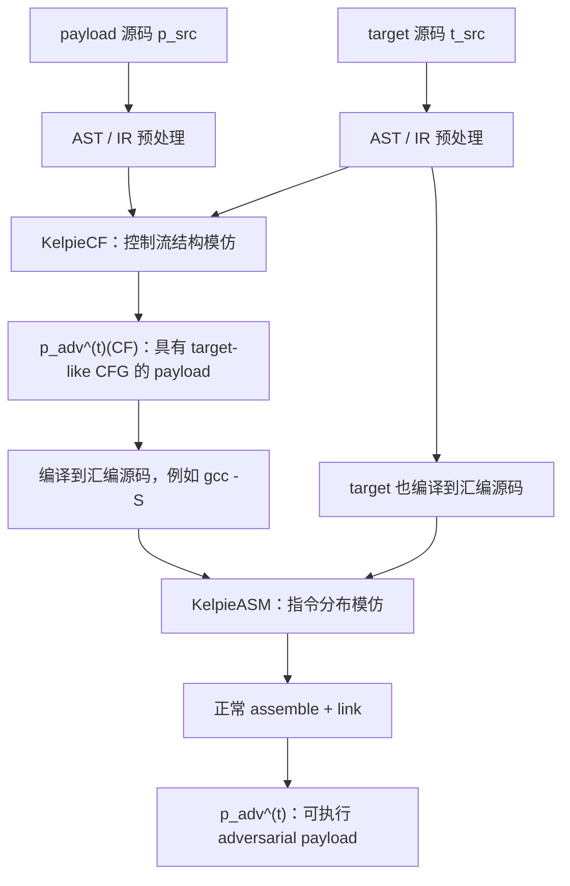
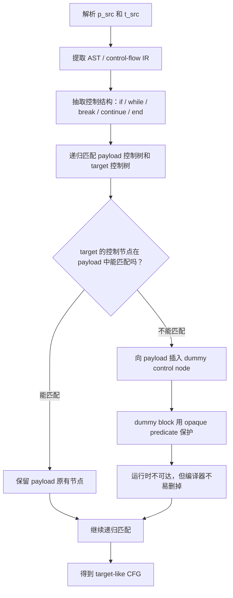
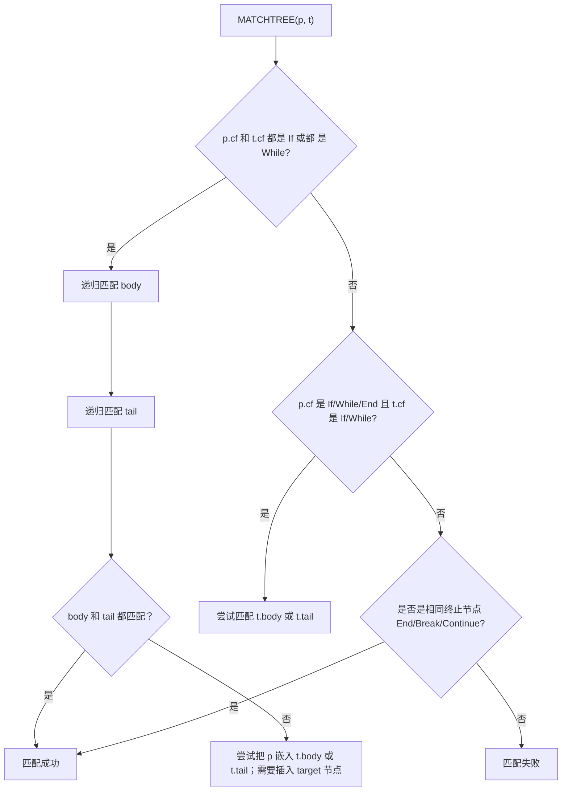
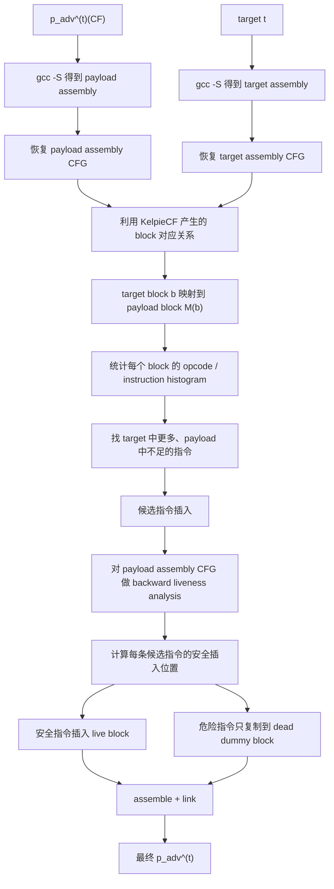
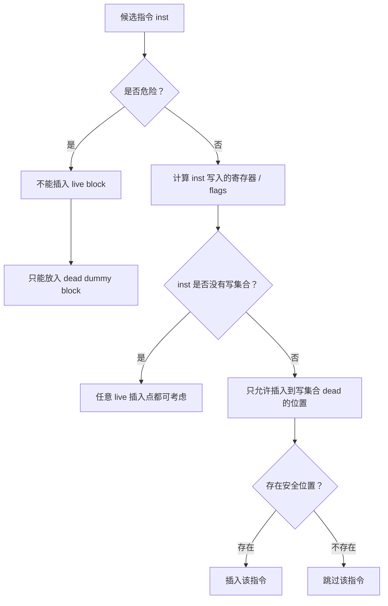
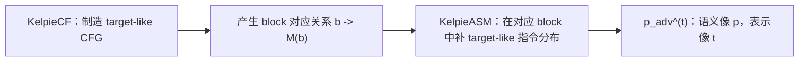

# Kelpie 技术路线笔记

## 论文

Attacking the First-Principle: A Black-Box Query-Free Targeted Mimicry Attack on Binary Function Classifiers

## 一句话总结

Kelpie 的核心思想是：在保持 payload 函数真实语义不变的前提下，把它的控制流结构和汇编指令分布伪装成某个 target 函数，从而让 ML-based binary function classifiers 把 payload 误判为 target。

它不是基于目标模型梯度、置信度或者查询反馈的攻击，而是一个 black-box、zero-query 的通用 mimicry workflow。

## 总体目标

给定：

- `p`：payload 函数，真实要保留的行为，例如有漏洞函数或恶意函数。
- `t`：target 函数，希望分类器把 payload 看成它，例如 patched 函数或 benign 函数。

Kelpie 生成：

- `p_adv^(t)`：语义仍然等价于 `p`，但在二进制函数分类器眼里更像 `t`。

攻击成功的标准是：

- 分类器不再认为 `p_adv^(t)` 像 `p`；
- 分类器认为 `p_adv^(t)` 像 `t`。

## 总体流程



关键工程选择：Kelpie 不直接改 linked binary，而是在两个更容易控制的层次做改写：

- `KelpieCF`：改 C 源码 / AST 层；
- `KelpieASM`：改 compiler-generated assembly；
- 最后让标准 assembler/linker 重新计算地址、跳转偏移和 relocation。

这样避免了 post-link binary rewriting 中很麻烦的指令长度变化、跳转偏移失效、relocation 破坏等问题。

## Workflow 1：KelpieCF

### 目标

`KelpieCF` 负责让 payload 的 CFG 结构模仿 target 的 CFG 结构，同时不改变 payload 的真实行为。

### 输入输出

- 输入：payload 的 C 源码 `p_src`
- 输入：target 的 C 源码 `t_src`
- 输出：控制流结构已经向 target 对齐的 payload：`p_adv^(t)(CF)`

### 流程图



### 算法图

论文的 Algorithm 1 是一个简化的 control-flow tree matching，主要展示 `if` 和 `while` 两类结构。



### 为什么还能执行

`KelpieCF` 的语义保持靠一个构造性保证：

- 只向 payload 增加 dummy basic blocks；
- dummy blocks 在运行时不可达；
- 不修改 payload 原本会执行的 basic blocks；
- 不引入会改变程序状态的新执行路径。

论文原型中，dummy block 由一个全局 `dead` flag 控制。这个 flag 的值让分支运行时永远不会进入 dummy block，但 GCC/Clang 又不能静态推断它的值，因此不会把 dummy block 优化掉。

### 局限

- target 的控制结构数量要足够多，否则 payload 无法嵌进去；
- target 太小时，需要换更复杂的 target，或者把 payload 拆成多个模块；
- 论文算法只展示了 `if` / `while`，真实 C 代码中的 `for`、`switch`、`goto`、early return、宏、inline asm 等都需要额外工程处理。

## Workflow 2：KelpieASM

### 目标

`KelpieASM` 负责让已经 CFG 对齐的 payload 在汇编指令分布上进一步模仿 target。

换句话说：

- `KelpieCF` 解决“结构像不像”；
- `KelpieASM` 解决“每个 block 里的 opcode / instruction pattern 像不像”。

### 输入输出

- 输入：`p_adv^(t)(CF)` 编译出的 assembly source；
- 输入：target 的 assembly source；
- 输出：最终 assembly，再 assemble/link 成 `p_adv^(t)`。

### 流程图



### 安全插入算法



### Liveness 分析

论文 Appendix Algorithm 2 给的是标准 backward flow-sensitive liveness analysis：

```text
OUT[i] = union IN[s] for s in successors(i)
IN[i]  = (OUT[i] - DEF[i]) union USE[i]
```

它不断迭代到 fixed point。对于候选指令 `inst`，只有当它写入的寄存器或 flags 在插入点之后是 dead，才允许插入。

直觉是：

- 如果插入指令写了一个之后还会被用到的寄存器，它会破坏程序状态；
- 如果写的是之后不会再用的寄存器/flags，就不会影响语义。

### 危险指令

论文明确说 live region 中排除这些指令：

- memory writes，例如 `mov [rax], rbx`
- stack manipulation，例如 `push`、`pop`
- control transfer，例如 `jmp`、`call`、`ret`
- 架构相关副作用指令

这些指令如果要保留 target-like pattern，只能复制到 dead dummy blocks 里，因为 dead blocks 不会执行。

### 为什么仍然能生成可执行二进制

`KelpieASM` 不改 linked binary，而是改 assembly source。此时：

- 跳转仍然使用 symbolic labels；
- 数据引用仍然是 symbolic references；
- instruction offsets 还没有固定；
- relocation 还没有最终确定。

修改完成后，正常 assembler/linker 会重新计算：

- jump displacement；
- instruction address；
- relocation entries；
- final binary layout。

因此，Kelpie 避开了二进制重写里最容易坏掉的 layout 问题。

## 两个 workflow 为什么必须组合



论文的 ablation study 说明：

- 只做 `KelpieCF`：CFG 像 target，但局部 instruction pattern 仍然不像，targeted mimicry 不稳定；
- 只做 `KelpieASM`：opcode 分布变化更强，容易造成 evasion，但缺少空间对应关系，不能稳定靠近指定 target；
- 两者组合：`KelpieCF` 提供全局结构和 block mapping，`KelpieASM` 在每个 mapped block 中补 target-like 指令特征，因此更容易把 embedding 推向 target。

## 文中明确披露的实现细节

论文明确提到：

- 输入是 C source functions；
- `KelpieCF` 基于 AST / control-flow preprocessing；
- proof-of-concept 用全局 `dead` flag 实现 opaque predicate；
- 考虑 GCC / Clang 的优化行为；
- `KelpieASM` 修改 `gcc -S` 生成的 assembly source；
- 指令语义抽象来自 Capstone framework；
- 实验中的函数特征提取使用 IDAPro；
- Zeek 使用 Angr 生成的 VEX IR，但这是被攻击 classifier 的特征抽取背景，不是 Kelpie 攻击 pipeline 的核心依赖。

论文没有完全展开：

- 具体 C parser / AST rewriting framework；
- 具体 assembly rewriting 框架；
- 完整 dangerous-instruction 列表；
- 编译优化后如何稳定保持 basic-block correspondence；
- ABI 细节如何保守处理，例如 callee-saved registers、stack alignment、vector registers、exception/unwind 信息。

## 对论文的理解

Kelpie 的关键洞察是：许多 binary function classifiers 并没有真正学到“函数语义等价”，而是相当依赖可操控的外观特征：

- CFG shape；
- basic-block 结构；
- opcode distribution；
- local instruction pattern。

因此，攻击者可以不查询模型、不知道模型结构，只要让 payload 在这些特征维度上模仿 target，就能让 embedding 向 target 漂移。

这也解释了为什么 case study 里可以出现两类实际风险：

- vulnerable function 仍然有漏洞，但被看成 patched version；
- keylogger / wiper 仍然有恶意行为，但被看成 benign binary 中的普通函数。
