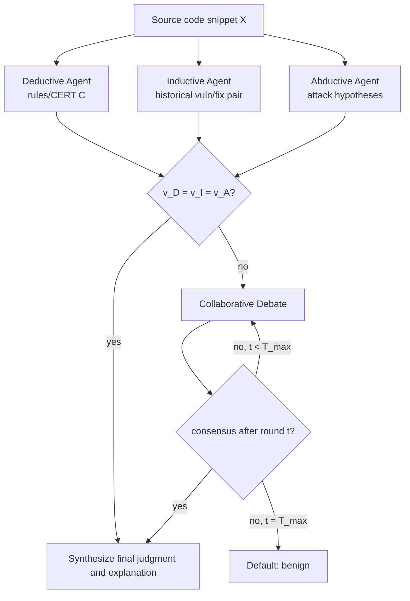

# Three Heads Are Better Than One: A Multi-perspective Reasoning Framework for Enhanced Vulnerability Detection

## One-line Takeaway

这篇论文提出 ReasonVul：用三个不同推理范式的 LLM agent 分别审查同一段源代码，再在判断冲突时通过多轮 debate 达成共识。它的主要价值不是新的静态分析算法，而是证明“多视角漏洞解释 + 冲突讨论”比单一 LLM 推理或简单多数投票更有效。

## 1. Motivation：为什么需要三个 agent

论文的核心动机来自 PairVul 上的观察：不同漏洞类型需要不同推理入口。作者用三个代表性方法映射三种推理范式：

- SAVul 代表 deductive reasoning：从通用安全规则出发，检查代码是否违反规则。
- Vul-RAG 代表 inductive reasoning：从历史漏洞/修复样例中检索相似模式，再类比当前代码。
- VulnSage 代表 abductive reasoning：先假设可能的攻击或失败场景，再反推代码中最可能的漏洞原因。

Fig. 1 显示三类方法正确识别的漏洞集合重叠很小，说明它们不是冗余 ensemble，而是各自覆盖不同漏洞区域。Fig. 2 的三个 motivating cases 进一步说明这种互补性：

- Case 1：整数溢出。`unsigned long` 被截断成 `unsigned int` 后做边界检查，大值可能 wrap 成小值并绕过检查。这里 deductive reasoning 最有效，因为它能直接应用“不同宽度整数转换可能导致截断/溢出”的安全规则。
- Case 2：use-after-free。`kfree(iter)` 后没有把 `seqf->private` 置空，后续路径可能访问 dangling pointer。这里 inductive reasoning 最有效，因为历史漏洞样例中存在类似 `seq_file` / dangling pointer 模式。
- Case 3：race condition。ICMP route lookup 中共享结构 `param->replyopts` 可能在不同上下文中被并发访问，导致 slab corruption。这里 abductive reasoning 最有效，因为它能从“并发网络路径下是否可能发生 race”这种攻击假设反推问题。

因此，三个 agent 的角色不是简单重复检测，而是把漏洞检测拆成三种互补的认知入口：

| Agent | 输入侧重点 | 擅长发现的漏洞 |
| --- | --- | --- |
| Deductive Agent | 源代码 + CERT C 等安全规则 | 规则型漏洞，如整数转换、资源管理、边界检查违规 |
| Inductive Agent | 源代码 + 历史 vulnerable/fixed pair | 历史上反复出现的 API/框架/代码模式问题 |
| Abductive Agent | 源代码 + 攻击者视角假设推理 prompt | 复杂上下文漏洞，如 race condition、逻辑缺陷、攻击路径驱动的问题 |

最终配置中三个 agent 还使用不同模型：Deductive Agent 使用 Phi-4，Inductive Agent 使用 Llama4，Abductive Agent 使用 DeepSeek。作者先在 PairVul 上测试不同模型在三种 reasoning paradigm 下的 PairAcc，再给每个范式选择表现最好的模型。

有效性证据主要有三类：

- Full ReasonVul 在 PrimeVul 上 PairAcc 40.00%、F1 72.52%，高于所有 baseline。
- 去掉任一 agent 都下降：去掉 Deductive 后 PairAcc 35.00%，去掉 Inductive 后 31.95%，去掉 Abductive 后 24.60%。去掉 Abductive 降幅最大，说明攻击场景式推理对复杂漏洞尤其重要。
- 单 agent 版本明显低于 full version：Deductive-only PairAcc 25.28%，Inductive-only 20.92%，Abductive-only 27.81%。

需要注意的是，论文的 ablation 没有完全拆开“推理范式、prompt、knowledge source、underlying model”的贡献。比如 Abductive Agent 的贡献同时来自 abductive reasoning、attacker-style prompt 和 DeepSeek 模型，论文没有做“同一模型跑三种 agent”或“模型互换”的细粒度对照。

## 2. Debate 的实施流程与细则

ReasonVul 对每个 agent 的输出建模为：

```text
O_i = (v_i, e_i)

v_i: binary judgment，1 表示 vulnerable，0 表示 benign
e_i: 自然语言解释，说明为什么判 vulnerable 或 benign
```

也就是说，框架当前处理的是“这段代码是否有漏洞”的二分类结论，而不是显式维护一个候选漏洞列表。

整体流程如下：



debate 触发条件很简单：只要三个 agent 的 `v_i` 不完全一致，就进入 debate。典型冲突包括：

```text
1 vs 0 vs 0
1 vs 1 vs 0
0 vs 1 vs 0
```

每一轮 debate 中，每个 agent 同时接收以下上下文：

- 原始 source code `X`。
- 自己的知识源 `K_i`：规则库、历史样例库，或自身攻击知识。
- 自己此前所有轮次的输出历史 `{O_i^0, ..., O_i^{t-1}}`。
- 其他 agent 上一轮的输出 `{O_j^{t-1} | j != i}`，尤其是和自己判断冲突的解释。

然后每个 agent 并行执行三步：

1. Audit：审查其他 agent 的 reasoning chain，尤其关注冲突判断背后的证据是否成立。
2. Re-evaluate：基于自己的推理范式重新检查代码和证据。
3. Revise or rebut：如果对方论证揭示了自己先前推理的漏洞，就修改判断；如果认为对方推理不成立，就反驳并维持原判断。

论文强调每轮是 parallel deliberation，而不是按顺序发言。这样做是为了避免先发言 agent 对后续 agent 造成顺序偏置。

每轮结束后，框架重新检查：

```text
T_t =
  exit,   if v_D^t = v_I^t = v_A^t
  debate, otherwise
```

如果三者一致，就终止 debate，并把三者收敛后的 reasoning synthesize 成最终解释。如果到 `T_max` 轮仍然无法一致，则默认输出 benign。作者选择这个 conservative fallback 的理由是 LLM 漏洞检测容易过度报漏洞，默认 benign 可以降低 false positive 和 alert fatigue。

论文最终设置 `T_max = 2`。消融中，0 轮等价于多数投票，PairAcc 只有 21.67%；1 轮提升到 26.46%；2 轮最好，PairAcc 30.42%；更多轮开始下降。作者认为原因是多轮上下文过长会让 agent 推理变混乱或过度保守。

Case study 中 CVE-2021-41864 展示了 debate 的价值：初始时 Deductive 和 Inductive 都判 benign，只有 Abductive 判 vulnerable。如果用多数投票会漏报。但 Abductive Agent 提出“用户可控 value_size 触发整数溢出，导致分配大小不足和越界写”的攻击路径后，Deductive Agent 重新从 arithmetic safety 而非仅从资源释放规则审查代码，Inductive Agent 也重新将其归入 CWE-190 类历史模式，最后三者收敛到 vulnerable。

定量上，PrimeVul 中有 542 个初始冲突样本。多数投票只正确解决 49 个，约 9.04%；collaborative debate 正确解决 389 个，约 71.77%。这说明 debate 的主要作用是保护少数派 agent 的有效证据，不让它被简单 voting 直接淹没。

## 3. 不足与值得追问的问题

这篇论文最值得追问的是输出接口过于粗：每个 agent 只输出 `(v_i, e_i)`，其中 `v_i` 是 vulnerable/benign 二分类。这样会带来几个问题。

第一，三个 agent 可能看到的是不同漏洞，但框架没有显式区分。真实代码中很可能同时存在多个潜在问题，例如：

```text
Deductive Agent: 发现整数截断导致 bounds check bypass
Inductive Agent: 发现 free 后 dangling pointer 模式
Abductive Agent: 发现并发访问共享结构导致 race condition
```

如果三者都输出 `v_i = 1`，ReasonVul 会认为已经 consensus，直接 synthesize final explanation。但这个 consensus 可能只是“都觉得有问题”，而不是“对同一个漏洞达成一致”。论文没有说明如何对齐 root cause、CWE、触发路径、代码位置和 exploit condition。

第二，如果只有 1 个 agent 发现漏洞，debate 依赖自然语言解释说服其他 agent。这比多数投票好，但仍然缺少机制化验证。比如少数派 agent 可能提出一个真实漏洞，也可能提出一个 hallucinated attack path。论文让其他 agent audit/re-evaluate，但没有引入静态分析器、符号执行、单元测试、补丁差分或可执行验证来确认该路径。

第三，`T_max` 后默认 benign 有降低误报的好处，但也可能压掉真实漏洞。论文自己在 Fig. 6 附近承认，Deductive 和 Inductive agents 分别有 25 和 12 个独自发现的漏洞没有进入 ReasonVul 最终判定，说明 debate 可能 over-prioritize 某些 reasoning line，使正确的少数派发现被否决。

第四，模型选择归因不够干净。最终系统同时改变了推理范式、prompt、知识源和底层模型，因此 full system 的提升不能完全归因于“三种推理范式”本身。更理想的 ablation 应包括：

- 同一个强模型分别扮演三个 agent，与三模型专用配置对比。
- 三个 agent 互换底层模型，观察性能是否稳定。
- 固定模型，只变 prompt/knowledge source。
- 固定 prompt/knowledge source，只变模型。
- 输出多个候选漏洞，并对每个候选漏洞单独 debate、合并、验证。

第五，实际应用中更合理的输出可能不是一个二分类，而是候选漏洞集合：

```text
[
  {
    "location": "...",
    "root_cause": "...",
    "cwe": "...",
    "trigger_condition": "...",
    "evidence": "...",
    "agent_support": ["Deductive", "Abductive"],
    "status": "confirmed | rejected | unresolved"
  }
]
```

这样 debate 的对象就不是“这段代码总体 vulnerable 吗”，而是“候选漏洞 A/B/C 分别是否成立”。这会更贴近实际审计场景，也能处理多个 agent 看到不同漏洞的问题。

## Reading Notes

我的理解是，ReasonVul 的强项是把 LLM 漏洞检测从单次判断推进到多视角协作判断：先用三个认知入口扩大召回，再用 debate 保护少数派证据并降低简单 voting 的误杀。但它目前仍是 benchmark-oriented 的二分类框架，对真实审计中“多漏洞、多位置、多 root cause、候选路径验证”的处理还比较弱。

如果后续借鉴这篇做系统，可以考虑把 ReasonVul 改造成 candidate-centric pipeline：第一阶段每个 agent 生成结构化候选漏洞；第二阶段做候选聚类和 root-cause alignment；第三阶段让 agent 围绕每个候选漏洞分别 debate；第四阶段接静态/动态验证工具给每个候选打证据分。这样会比单一 `(v_i, e_i)` 更适合实际漏洞挖掘。
